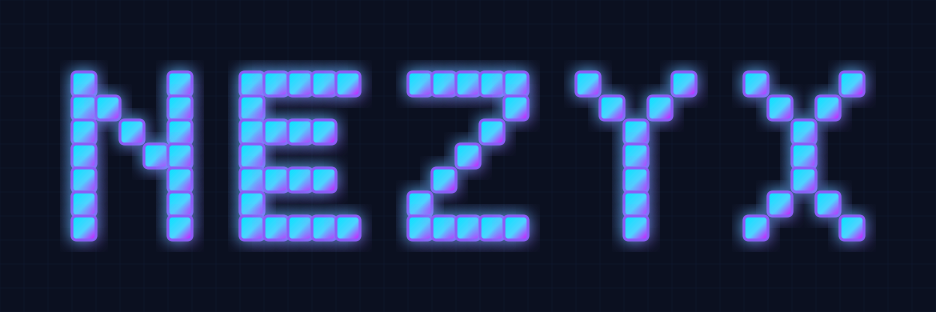

<p align="center">
  
</p>

<p align="center">
  <strong>RF • WIRELESS • DRONES / UAS • SECURITY • HARDWARE • CODE</strong>
</p>

<p align="center">
  A workshop for things that fly, transmit, authenticate, automate,<br>
  or probably shouldn't have been taken apart in the first place.
</p>

<p align="center">
  <a href="https://stevecoffey.me">
    
  </a>
  
</p>

---

## 🔧 The Workshop

I'm **Nezyx**.

This is where I keep the projects, experiments, references, half-finished ideas, and occasionally questionable decisions that come from pulling on technical threads just to see where they go.

My interests tend to live somewhere between **cybersecurity, radio, aviation, embedded hardware, physical security, and automation**.

A lot of what ends up here starts with:

> *“I wonder if I can make these two things talk to each other…”*

and deteriorates from there.

---

## 📡 Currently on the Bench

`RF / SDR`
`Wardriving`
`Wi-Fi`
`HackRF`
`Flipper Zero`
`NFC / RFID`
`Meshtastic`
`ESP32`
`Raspberry Pi`
`Drones / UAS`
`Remote ID`
`OSINT`
`Physical Security`
`Automation`

---

## 📡 RF / Wardriving

Wireless exploration, spectrum hunting, mapping, and experimentation.

[](https://wdgwars.pl/)

---

## 🧪 Areas of Interest

### 📡 RF & Wireless

SDR, HackRF, spectrum exploration, wireless protocols, wardriving, Wi-Fi, Bluetooth, Meshtastic, antennas, and generally figuring out what is transmitting around me.

### 🚁 Drones & UAS

UAS hardware, Remote ID, telemetry, RF behavior, embedded integrations, mapping, aviation technology, and experimental drone tooling.

### 🔐 Security

Cybersecurity, OSINT, physical security, access control, NFC/RFID, digital forensics, vulnerability research, and security automation.

### 🛠️ Hardware & Embedded

Flipper Zero, ESP32, Raspberry Pi, microcontrollers, sensors, radios, odd peripherals, and making hardware do things its manufacturer probably didn't document.

### 🤖 Automation & Software

Python, APIs, Discord integrations, data gathering, bots, utilities, and glue code for connecting systems that weren't designed to work together.

---

## 🚀 Featured Work

### 📻 HackRF Frequency Reference

A practical frequency reference for exploring the RF spectrum with HackRF and other SDR hardware.

**Focus:** `RF` `SDR` `HackRF` `Spectrum`

[View Repository →](https://github.com/Nezyx-Workshop/hackrf-freq-reference)

---

### 🚙 Vehicle OSINT Collection

A curated collection of resources and techniques focused on vehicle-related open-source intelligence.

**Focus:** `OSINT` `Vehicles` `Research`

[View Repository →](https://github.com/Nezyx-Workshop/Vehicle-OSINT-Collection)

---

### 🕵️ OSINT I Bot

Discord-based OSINT tooling integrating OSINT Industries searches into an operational workflow.

**Focus:** `OSINT` `Python` `Discord` `Automation`

[View Repository →](https://github.com/Nezyx-Workshop/OSINT_I_Bot)

---

### 📱 StoryPod NFC

Research and experimentation involving StoryPod NFC tags, cards, books, and character tokens.

**Focus:** `NFC` `RFID` `Flipper Zero`

[View Repository →](https://github.com/Nezyx-Workshop/StoryPod_NFC)

---

## 🧰 Tools I Reach For

<p align="center">
  
  
  
  
  
</p>

<p align="center">
  <code>HackRF</code> •
  <code>Flipper Zero</code> •
  <code>ESP32</code> •
  <code>Proxmark</code> •
  <code>SDR</code> •
  <code>Wi-Fi</code> •
  <code>NFC/RFID</code> •
  <code>Meshtastic</code>
</p>

---

## 🎓 Credentials

Cybersecurity is also what I do professionally, so there are a few letters floating around.

**ISC2**
`SSCP` • `CC`

**CompTIA**
`Security+` • `CySA+` • `PenTest+` • `Network+` • `A+` • `Project+`

**Other**
`ITIL 4 Foundation` • `AWS Cloud Practitioner` • `FAA Part 107` • `Cellebrite`

The full professional side lives at **[stevecoffey.me](https://stevecoffey.me)**.

---

## 📊 Workshop Telemetry

<p align="center">
  
</p>

<p align="center">
  
</p>

---

## ⌨️ Terminal

```text
nezyx@workshop:~$ ./status

[+] RF ................. listening
[+] drones ............. probably airborne
[+] hardware ........... disassembled
[+] security ........... questioning trust
[+] projects ........... more than finished
[+] curiosity .......... operational

nezyx@workshop:~$ _
```

<p align="center">
  <sub>Build things. Break assumptions. Document what happens.</sub>
</p>
