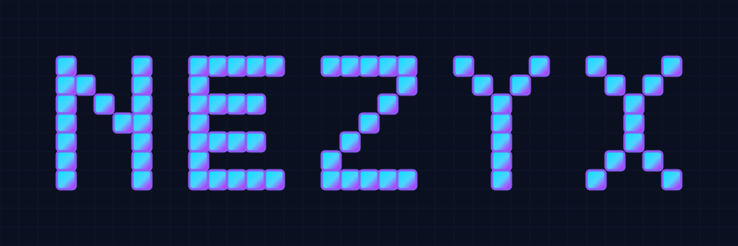

  

  

<em>OSINT • Discord bots • Flipper / HackRF • Physical Security • experimentation</em>

  <!-- Discord placeholder: replace INVITE_CODE when ready -->
  
  

---

### 🧭 About
- 🕵️ Building **OSINT** tools and automation that live nicely inside **Discord**.  
- 📡 Playing with **SDR**, HackRF refs, and odd radio signals.  
- 💥 Physical Security Enthusiast.

---

### 🧱 Stack

  
  
  
  
  
  
  
  
  

<!-- Palette reference for badges/assets:
Cyber Cyan #00E5FF • Electric Blue #4FD3FF • Magenta #E100FF • Violet #8B5CF6 • Teal #00B8D4 • Graphite #0B1020
-->

---

### 🚀 Projects
- **OSINT_I_Bot** — Discord bot that taps OSINT.industries search.  
  `Python` • `discord.py` • `OSINT`  
  Repo: https://github.com/Nezyx-Workshop/OSINT_I_Bot

- **OSINTHub** — browser hub combining multiple OSINT tools in one place.  
  `JavaScript` • `Dashboards`  
  Repo: https://github.com/Nezyx-Workshop/OSINTHub

- **ops-discord-bot** — operational helper bot experiments.  
  `Python` • `discord.py`  
  Repo: https://github.com/Nezyx-Workshop/ops-discord-bot

- **hackrf-freq-reference** — quick‑load text refs for HackRF file manager.  
  `SDR` • `field notes`  
  Repo: https://github.com/Nezyx-Workshop/hackrf-freq-reference

> more tinkering/forks: DorkBot, Flipper_Zero, Signal-Server, Vehicle‑OSINT… see Repos/Stars.

---

### 🗓️ Now
- 🔧 polishing OSINT + Discord automation
- 📡 expanding Flipper Zero/HackRF tools
- 🎛️ experimenting with all things RF

---

### 📊 Stats

  
  

  

---

<!-- Optional: contribution snake (enable workflow below) 

  

 -->
